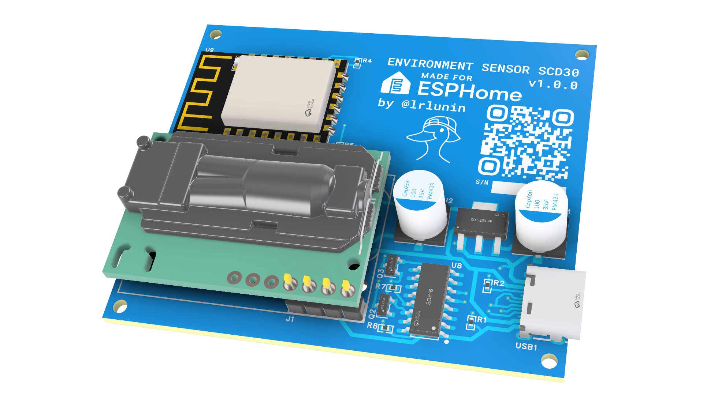

<picture>
  
</picture>

# SCD30-ESPHome

This project is a printed circuit board (PCB) for use of SCD30 environment sensor with the ESP8266 controller. This PCB also includes a built-in USB-UART bridge and can be programmed via the USB-C port without any external tools.

## Description

In this repository you can find all associated files as EasyEDA Pro project files, datasheets for sensors and used components and ESPHome firmware example.

## Firmware
Use the `esphome-sample-project.yaml` file as an example configuration for the ESPHome firmware.

### ESPHome Built-in history buffer

Unfortunately, the ESPHome `web_server` component does not really support the storage of the values' history. Even the `v3` version of the `web_server` only uses the values on the client side. So, after the page reload the values' history is not available.

With the `history_container` component in my [ESPHome fork](https://github.com/lrlunin/esphome/tree/history-container-component) and the adapted included [`web-server`](https://github.com/lrlunin/esphome-webserver/tree/handle-arrays) you are able to store the history of last `N` values on the ESP8266 itself and make your sensor fully self-contained.
